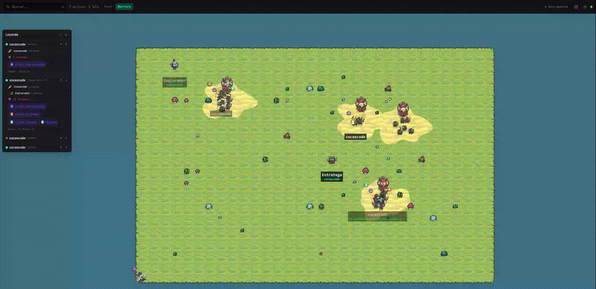

# xray

> **Stop babysitting your Claude Code sessions. Start commanding them.**

Every time Claude Code asks for permission, you're pulled out of flow — jumping between terminals, scrolling logs, searching for the session that's waiting on you. xray ends that. It's a real-time dashboard that sees every agent across every project, approves permissions from one place, and — because static dashboards are boring — lets you watch the whole thing as a pixel-art battlefield where each session is a warrior fighting goblins.



<p align="center">
  <b>One command.</b> Zero setup after install. Works on your laptop. Works on your phone. Works on anything with a browser.
</p>

---

## Why xray exists

Claude Code is powerful — but when you're running multiple sessions across several projects, you lose track fast:

- You don't know which session is waiting for permission **until you tab into that terminal.**
- You have no idea how many tokens each session has burned **until the context bar turns red.**
- Sub-agents come and go silently. You can't tell which ones are still running.
- If Claude asks you a question while you're in another window, **you'll miss it.**
- Reviewing what a session did last hour means scrolling through an endless wall of logs.

xray fixes all of that — in two views, from one dashboard, updated live.

## The 30-second pitch

- **See every session, across every project, in real time.** One tab. Permissions, tokens, tool calls, sub-agents, MCPs, skills — all live.
- **Never miss a permission again.** Approvals live in the dashboard. One click. Or flip on **Auto-approve** and forget they exist.
- **Make it fun.** Switch to the Warriors view and watch your sessions fight goblin camps that grow with your token usage. Same data. Pixel-art RPG.
- **100% local.** Your code never leaves your machine. SQLite database, Fastify server, Vue dashboard. No cloud. No telemetry.
- **Access it from your phone.** Scan a QR, type a 6-digit PIN, and approve permissions from the couch.

```bash
npm install -g @cocaxcode/xray
cxc-xray setup && cxc-xray
```

That's it.

---

## What you actually get

### Never miss a permission again

Every `PermissionRequest` from Claude Code arrives in the dashboard with a clear amber bubble — showing the tool name, the command or file path, and two buttons: **Aprobar** and **Denegar**. The bubble lives on top of the session card in Panel view, and floats over the warrior's head in the Warriors view, following the character as the camera moves.

> Too many permissions? Flip the **Auto-approve** toggle in the top bar. xray will instantly accept every incoming permission request — no prompt in the terminal, no click in the dashboard — and log each auto-approval in the event history so you know what happened. Turn it off whenever you want manual control back. It's the fastest way to let Claude run wild while still seeing everything.

The same dashboard also catches `waiting_input` — the moments when Claude is waiting for *you* to answer a question. The question itself appears above the warrior's head in purple, and as a banner on the session card. As soon as the model continues, it disappears.

### See what every session is doing — right now

**Panel view.** Responsive card grid. Each session card shows:

- Model, context percent, token delta since last stop, status dot
- Topic (the first user message, auto-extracted from the transcript)
- Live tool call feed: animated spinner during `PreToolUse`, green check on success, red cross on failure
- MCPs used, skills active, sub-agents running
- Last assistant message with full markdown rendering (fenced code, tables, inline code, lists — click to expand)
- Amber border blinks when a permission is pending. Purple when waiting for your input.

**Click any card** and a split detail panel opens with two tabs:

- **Historial** — paginated event list, 50 per page, click any tool call to inspect full input and response JSON
- **Resumen** — session duration, input/output tokens, files touched (with edit counts), tool breakdown, error count, MCPs used, sub-agents spawned — all computed live from the SQLite store

### The Warriors view

Same data. Completely different experience.

| What you see | What it means |
|---|---|
| A warrior | One Claude Code session |
| The warrior's color | A deterministic hue for that session (8 preset offsets, cycled) |
| Companions next to the warrior | Sub-agents currently running |
| Crystals orbiting the warrior | MCPs that session is using (blue/red/green/purple per MCP) |
| A weapon or scroll overlay | The skill currently active (`sdd-apply` → big sword, `sdd-explore` → telescope, `copywriting` → bow, and so on) |
| A camp of goblins to the side | Token pressure — 3 goblins at 0 tokens, up to 18 at 1 million |
| A dirt patch and tent behind the goblins | Organic campground with noise-perturbed edges, drawn under the characters |
| An amber bubble over the warrior's head | A permission request. Click **Aprobar** to approve. The bubble follows the warrior as you pan. |
| A purple bubble with text | Claude is waiting for your input. The text is the question itself. |

Explore companions fight from behind with idle sway. Strategists and melee types charge toward the goblin camp with the warrior. Ranged sub-agents stay back. Every character has a translucent name label that turns opaque on mouse hover. The camera auto-fits the entire map on load. Pan with drag, zoom with scroll or pinch, double-click to focus on a character.

Yes — **it's also responsive.** Mobile gestures work out of the box.

### Real tokens, not guesses

Every context percentage and token counter is read **directly from Claude Code's transcript JSONL files** — incrementally, tracking the byte offset per session so we never re-read the same line twice. No estimation. No approximation. You see exactly what Claude saw.

### Your phone as a remote control

Start xray with `--expose` and it binds to your LAN. The terminal prints a QR code. Scan it with your phone. Type the 6-digit PIN that shows in the terminal. You're in.

- **256-bit token** generated on startup, persisted to SQLite — survives server restarts, so you only scan once.
- **PIN rotation** via `cxc-xray pin` — rate-limited, 5-minute expiry, never invalidates existing sessions.
- **Custom domain** support for reverse-proxied setups: `cxc-xray --expose --domain https://xray.example.com`.
- **Hook endpoints stay localhost-only** — even in expose mode, Claude Code can only write from `127.0.0.1`. Remote access is read + approve only.

---

## Auto-approve mode — the feature that changes how you use Claude Code

Click the **Auto-approve** button in the top bar. It pulses green. From that moment on:

- Every `PermissionRequest` from any session is accepted instantly.
- Claude Code receives `{ behavior: "allow" }` before it can even show you a prompt.
- The auto-approval is logged in the dashboard as `permission:auto-approved` so you always know what was approved.
- Switch it off whenever you want the safety net back.

This is the mode for when you've already reviewed the task, you trust Claude to execute it, and you just want it to *go*. It's the closest thing to `--dangerously-skip-permissions` without giving up visibility — you still see every tool call in the feed, you still get the history, you still get the token counters. You just skip the clicks.

> **Heads-up:** Auto-approve is a global switch. It resets to OFF on server restart. Treat it like you would any trust boundary: on when you're watching, off when you're not.

---

## Install

```bash
# Install globally
npm install -g @cocaxcode/xray

# Inside any project where you want to track Claude Code
cxc-xray setup

# Start the dashboard (auto-opens browser at http://localhost:3333)
cxc-xray
```

`cxc-xray setup` registers 10 hooks in `~/.claude/settings.json`: `SessionStart`, `SessionEnd`, `PreToolUse`, `PostToolUse`, `PostToolUseFailure`, `PermissionRequest`, `Notification`, `SubagentStart`, `SubagentStop`, `Stop`. The install is non-destructive — it appends to existing hook arrays and creates a `.backup` of your settings before touching anything.

To remove it cleanly:

```bash
cxc-xray uninstall
```

## Commands

| Command | What it does |
|---|---|
| `cxc-xray` | Start the dashboard on port 3333 (auto-opens browser) |
| `cxc-xray setup` | Register hooks in Claude Code (idempotent, safe to re-run) |
| `cxc-xray uninstall` | Remove xray hooks from settings.json |
| `cxc-xray status` | Check if xray is running on a port, show session count and uptime |
| `cxc-xray pin` | Generate a new 6-digit PIN for remote access |
| `cxc-xray --expose` | Bind to `0.0.0.0` and show QR + PIN for LAN access |
| `cxc-xray --domain <url>` | Public domain for QR (for reverse-proxied deployments) |
| `cxc-xray --port <n>` | Custom port (default 3333) |
| `cxc-xray --auth-token <token>` | Supply a pre-known auth token |
| `cxc-xray --no-open` | Don't auto-open the browser |

---

## Make it yours — the template system

The Warriors view is just **one** template. The entire scene engine is 100% driven by a single `template.json` file plus PNG sprite assets. No engine code needs to change to create a new theme.

A template defines:

- **Maps** — three sizes (small/medium/large), each with a tile grid, a walkable grid, and zones for `work`, `rest`, `spawn`, `exit`
- **Procedural work zones** — let xray scatter zones across the map automatically with `workZoneGen`, or define them manually
- **Sprites** — per-animation sprite sheets (Tiny Swords format), frame sizes, speeds, loop flags, optional facing
- **Tile regions** — reference sub-regions inside a tilemap PNG via `[x, y]` offsets
- **State animations** — map session state (`active`, `idle`, `waiting_input`…) to animation names
- **Tool animations** — map Claude tool names to character animations (Bash → attack, Read → idle, Edit → attack_2, Agent → guard)
- **Agent types** — display name and sprite for each sub-agent type (`Explore` → "Explorador" + archer sprite)
- **Equipment map** — which skill shows which weapon overlay (`sdd-explore` → telescope, `sdd-apply` → sword-big)
- **Environment map** — which MCP shows which crystal color
- **Enemy scaling** — token thresholds → enemy count + sprite variants to rotate through
- **Decorations** — random scatter of props with a weighted sprite list
- **Colors** — background, ground, fallback tile
- **State labels** — human-readable names for character states in the Legend UI
- **Gameplay mechanics** — walk speed, wander timers, combat oscillation ranges, enemy advance percent, formation spacing, render scales, camp dimensions, MCP orbit radius

Drop a folder into `~/.xray/templates/<name>/` and it appears in the view switcher — no restart, no rebuild. Community templates override built-in templates by name.

---

## Architecture

```
Claude Code hooks ──HTTP POST──▶ Fastify server ──WebSocket──▶ Vue dashboard
                                      │
                                      ├─▶ SQLite (WAL, FTS5, incremental migrations)
                                      └─▶ In-memory (active tools, pending permissions)
```

**Key design decisions**:

- **Deferred Promise permissions** — the `PermissionRequest` hook holds the HTTP connection open (up to 9 minutes) until you click a button. Claude Code blocks on the response. This is how xray can intercept and gate every tool execution without any terminal interaction.
- **Two views, one data source** — Panel and Warriors share the same WebSocket composables. Switching views loses no state.
- **Hue-shift sprite coloring** — 8 preset hue offsets, applied per character via an offscreen canvas cache. One sprite sheet, unlimited unique colors, zero extra assets.
- **Token counter = tangible pressure** — instead of a boring progress bar, the goblin count grows with total tokens. 3 at start, 18 at a million. Context usage becomes visceral.
- **Non-destructive hooks install** — appends to existing arrays, creates backups, removes only xray's entries on uninstall.
- **Persistent auth** — Bearer token stored in SQLite so QR codes scanned on mobile keep working across server restarts.
- **Real token extraction** — incremental JSONL reads from transcript files, byte-offset tracked per session, capped at 1MB per call.

## Tech stack

| Layer | Stack |
|---|---|
| Runtime | Node.js 18+, ESM |
| Server | Fastify 5, @fastify/websocket, better-sqlite3, commander, qrcode-terminal |
| Dashboard | Vue 3 (Composition API, `<script setup>`), Vite 6, TailwindCSS 4 |
| Scene engine | Canvas 2D, A* pathfinding, per-animation sprite sheets, hue-shifted palette swaps |
| Language | TypeScript strict mode everywhere |
| Testing | Vitest 3 (101 tests passing) |
| Package manager | pnpm workspaces |

## Development

```bash
pnpm install
pnpm build           # Build dashboard + server
pnpm dev:dashboard   # Vite dev server with HMR on localhost:5173
pnpm dev:server      # tsx watch mode
pnpm test            # Run the test suite
```

The Vite dev server proxies API and WebSocket to `localhost:3333`, so run the real xray server in another terminal with `pnpm start` or `node packages/server/bin/cxc-xray.js`.

## Credits

Pixel art sprites from **[Tiny Swords](https://pixelfrog-assets.itch.io/tiny-swords)** by Pixel Frog. Used under the Tiny Swords license for the built-in Warriors template.

## License

MIT © cocaxcode
